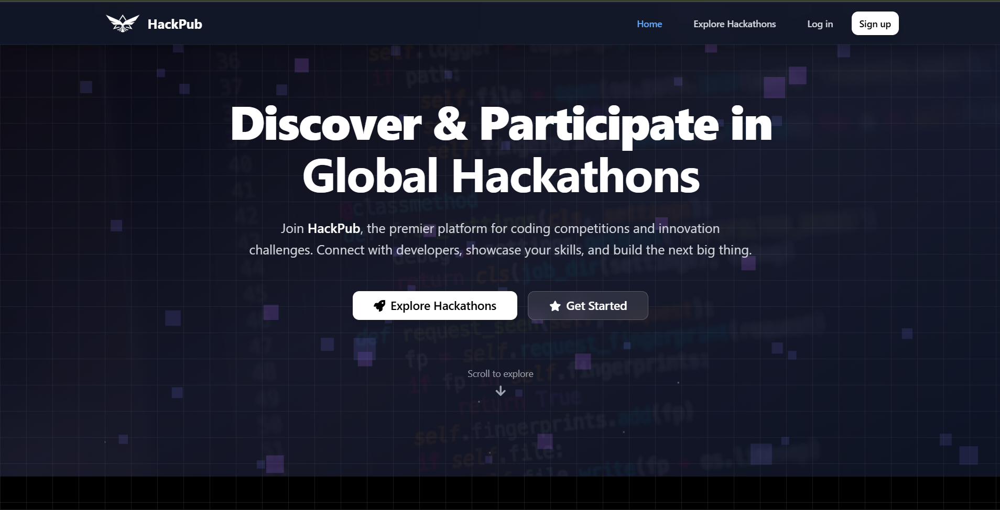

# 🚀 HackPub - Modern Hackathon Platform

<div align="center">

**A sleek, modern platform for creating, managing, and participating in hackathons worldwide**

[](https://reactjs.org/)
[](https://www.typescriptlang.org/)
[](https://tailwindcss.com/)
[](https://www.mongodb.com/)
[](https://nodejs.org/)

</div>

## 🖼️ Screenshots

<div align="center">

### 🌟 Modern Dark UI with 3D Effects & Glassmorphism



_Experience the sleek dark theme with neon accents, 3D card effects, and beautiful glassmorphism design_

</div>

## ✨ Features

### 🎨 **Modern Dark UI with 3D Effects**

- **Sleek Dark Theme**: Eye-catching dark interface with neon accents
- **3D Card Effects**: Interactive cards with hover animations and depth
- **Glassmorphism Design**: Beautiful glass-like components with backdrop blur
- **Particle Background**: Dynamic animated particle system
- **Responsive Design**: Optimized for all screen sizes

## 🔁 Recent Changes (Aug 2025)

These are the most notable UI and backend improvements made recently while developing this project. They reflect work to normalize submissions, improve winner handling, and clean up frontend flows.

- Normalized Submissions collection

  - Introduced a dedicated `Submission` model and collection to store project submissions separately from `Hackathon.participants`.
  - Submissions include fields like `hackathonId`, `participantId`, `userId`, `teamName`, `projectTitle`, `githubLink`, `liveUrl`, `projectDescription`, `evaluation`, `ranking`, and `winner` metadata.

- New backend APIs

  - `POST /api/hackathons/:hackathonId/submissions` — create a normalized submission.
  - `GET  /api/hackathons/:hackathonId/submissions` — list submissions for a hackathon.
  - `POST /api/hackathons/:hackathonId/submissions/:submissionId/declare-winner` — declare a winner scoped to a submission.
  - Legacy participant-scoped endpoints are preserved for compatibility (e.g. `POST /api/hackathons/:hackathonId/declare-winner` and participant-scoped variants).

- Frontend changes

  - `HackathonDetails` now fetches and renders normalized submissions when available and uses the new create/list/declare submission APIs.
  - Submission modal updated to include an optional `Project Title` field and uses the normalized `createSubmission` flow.
  - `hackathonService` has helper functions for `createSubmission`, `listSubmissions`, and `declareWinnerBySubmission` which prefer submission-scoped routes and fall back to legacy participant-scoped routes if needed.
  - `Dashboard` now prefers showing winner badges and "View Project" links driven by normalized submissions (falls back to legacy `participant.projectSubmission` when normalized submissions are not present).

- Declare winner behavior

  - Winner declaration is now scoped to a specific submission document, preventing cross-hackathon conflicts when the same user participates in multiple hackathons.
  - The UI pre-fills the declare-winner modal with existing winner data when available and supports overwrite via an `overwrite` flag.

- Migration & tooling

  - A non-destructive migration script was added at `scripts/migrate-submissions.ts` to copy existing `participant.projectSubmission` entries into the normalized `Submission` collection. The script is idempotent for hackathon+participant pairs and is optional — run it only if you want historical submissions visible in the new UI.
  - Package script added: `npm run migrate:submissions` (runs the migration script via `tsx`).

- Notes about rollout
  - The code keeps legacy fallbacks so the app remains functional before/after migration.
  - New normalized APIs are preferred for new submissions; historical data will remain visible only if migrated or if legacy participant-based submission fields are still present.

If you'd like, I can: add a `--dry-run` mode to the migration script, run the migration for you against a specified DB, or remove legacy fallbacks once you've confirmed migration.

### 🔐 **Robust Authentication System**

- **Google OAuth Integration**: Sign in/up with Google accounts
- **Session Management**: 24-hour sessions with auto-refresh
- **JWT Token Security**: Secure token-based authentication
- **Session Status Indicator**: Real-time session monitoring
- **Multi-Provider Support**: Local and Google authentication

### 🏆 **Comprehensive Hackathon Management**

- **Create & Edit Hackathons**: Full-featured hackathon creation with rich forms
- **Advanced Search & Filtering**: Find hackathons by category, location, and more
- **Participant Management**: Handle registrations and team formations
- **Payment Integration**: Razorpay integration for registration fees
- **Project Submissions**: Submit and evaluate hackathon projects

### 📊 **Smart Dashboard**

- **Role-Based Views**: Different interfaces for hosts and participants
- **Analytics & Stats**: Track participation, completion rates, and more
- **Quick Actions**: Easy access to common tasks
- **Recent Activity**: Stay updated with latest hackathon activities

### 🎯 **Enhanced User Experience**

- **Real-time Updates**: Live session status and notifications
- **Smooth Animations**: Fluid transitions and micro-interactions
- **Loading States**: Beautiful loading indicators and skeleton screens
- **Error Handling**: Comprehensive error messages and recovery options

# � Hackathon Platform

An end-to-end platform for hosting, managing, and participating in hackathons. Features include registration, project submission, winner declaration, payment integration, and a modern, interactive UI.

---

## 🌟 Features

### Hackathon Management

- Create, edit, and delete hackathons with custom details, dates, and rules
- View all upcoming and past hackathons
- Admin dashboard for managing hackathons and participants

### Registration & Participation

- Register for hackathons with a modern, themed form (styled with Tailwind & shadcn/ui)
- Google OAuth login for quick, secure authentication
- Session management with JWT and refresh logic

### Project Submission

- Submit projects scoped to specific hackathons
- Each submission includes project details, links, and description
- Submissions are normalized: winners are tracked per hackathon, allowing repeat wins in different events

### Winner Declaration

- Admins can declare winners for each hackathon
- Winner modal allows selection of 1st, 2nd, and 3rd place, with custom descriptions
- Winner badges and project links shown in dashboard and hackathon details

### Payment Integration

- Razorpay integration for paid hackathon registration
- Secure payment flow with backend verification

### AI Project Evaluation

- Google Gemini AI integration for automated project scoring (optional)

### Migration Tooling

- TypeScript script for migrating legacy submissions to the normalized model

### UI/UX Highlights

- 3D cards, glassmorphism, neon effects, animated particle backgrounds
- Responsive design for desktop and mobile
- Real-time session status indicator
- Beautiful loading states and error handling

### Security & Auth

- JWT-based authentication and session expiry
- Google OAuth for user onboarding
- Secure token storage and validation

### Developer Experience

- TypeScript throughout (frontend & backend)
- ESLint for code quality
- Vite for fast builds
- Concurrently for running frontend/backend together

---

## 🛠️ Tech Stack

**Frontend:**

- React 18 + TypeScript
- Tailwind CSS
- shadcn/ui
- React Router
- Vite

**Backend:**

- Node.js + Express
- MongoDB + Mongoose
- JWT
- Razorpay
- Google Gemini AI

**Tooling:**

- TypeScript
- ESLint
- tsx
- Concurrently

---

## 📁 Project Structure

```
hackathon-platform/
├── public/                 # Static assets
├── src/
│   ├── components/         # Reusable UI components
│   │   ├── ui/            # shadcn/ui components
│   │   ├── Navbar.tsx     # Navigation
│   │   ├── Footer.tsx     # Footer
│   │   └── ...
│   ├── pages/             # Page components (Home, Login, Dashboard, etc.)
│   ├── context/           # React contexts (Auth, Hackathon)
│   ├── services/          # API services
│   ├── db/                # Database models (Hackathon, User, Submission, Payment)
│   ├── types/             # TypeScript types
│   └── lib/               # Utility functions
├── server.ts              # Backend server
├── scripts/               # Migration scripts
└── ...
```

---

## 🚀 Getting Started

### Prerequisites

- Node.js v18+
- MongoDB (local or Atlas)
- Google OAuth credentials (for login)
- Razorpay API keys (for payments)

### Installation

1. Clone the repo:
   ```bash
   git clone https://github.com/udai7/hackathon-platform.git
   cd hackathon-platform
   ```
2. Install dependencies:
   ```bash
   npm install
   ```
3. Create a `.env` file in the root directory (see below for required variables)
4. Start the app:
   - Run both frontend & backend: `npm run dev:full`
   - Or run separately:
     - Backend: `npm run server`
     - Frontend: `npm run dev`
5. Access at:
   - Frontend: http://localhost:5173
   - Backend: http://localhost:5000

### Environment Variables

```env
# Server
PORT=5000
# Database
MONGODB_URI=your-mongodb-uri
# Auth
JWT_SECRET=your-jwt-secret
SESSION_SECRET=your-session-secret
# Google OAuth
GOOGLE_CLIENT_ID=your-google-client-id
GOOGLE_CLIENT_SECRET=your-google-client-secret
VITE_GOOGLE_CLIENT_ID=your-google-client-id
# Razorpay
RAZORPAY_KEY_ID=your-razorpay-key-id
RAZORPAY_KEY_SECRET=your-razorpay-key-secret
```

---

## 🔐 Authentication & Session Flow

- Google OAuth login (popup, JWT credential, session creation)
- 24-hour session expiry, 1-hour refresh threshold
- Secure token storage and expiry validation
- Session status indicator in UI

---

## 🏆 Winner Declaration & Submissions

- Submissions are stored per hackathon (normalized model)
- Admins can declare 1st, 2nd, 3rd place winners with descriptions
- Winner badges and project links shown in dashboard and details
- Migration script available for legacy data

---

## � Payment Integration

- Razorpay for paid hackathon registration
- Secure backend verification

---

## 🤖 AI Project Evaluation

- Google Gemini AI integration for automated scoring (optional)

---

## 🎨 UI/UX Highlights

- 3D cards, glassmorphism, neon effects
- Particle backgrounds, animated transitions
- Responsive and modern design

---

## 🐛 Troubleshooting

- Backend not running? Check MongoDB URI and port
- Google OAuth issues? Verify client ID and authorized origins
- Session problems? Clear localStorage, check JWT expiry
- Build errors? Run `npm install`, check TypeScript config

---

## 🤝 Contributing

1. Fork the repo
2. Create a feature branch
3. Commit and push your changes
4. Open a Pull Request

---

## 📄 License

MIT License. See [LICENSE](LICENSE).

---

## 🙏 Acknowledgments

- shadcn/ui
- Tailwind CSS
- React OAuth Google
- Lucide React
- Framer Motion

---

## 📞 Contact & Support

**Udai Das**  
[Email](mailto:udaid347@gmail.com) | [GitHub](https://github.com/udai7) | [Portfolio](https://udaidas.tech/)

---

**⭐ Star this repository if you found it helpful!**

Made with ❤️ by [Udai Das](https://github.com/udai7)
